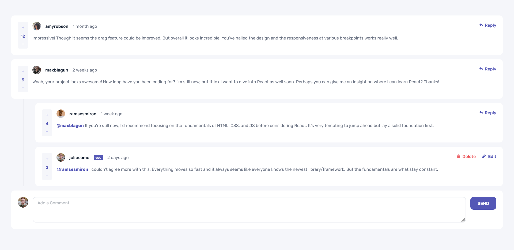
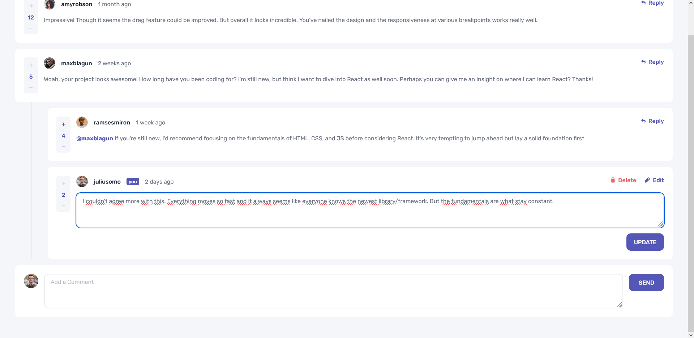
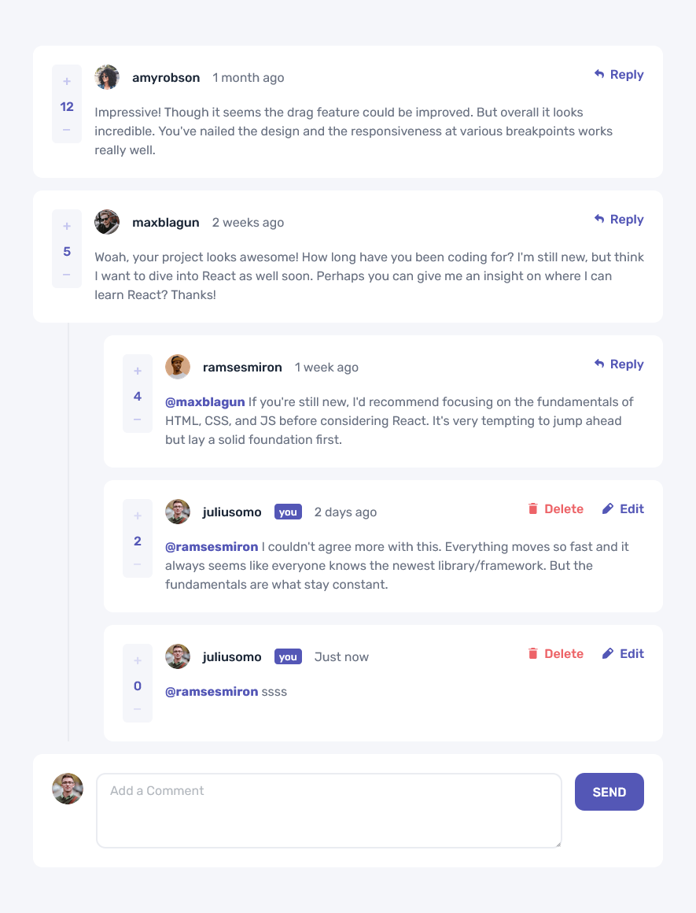
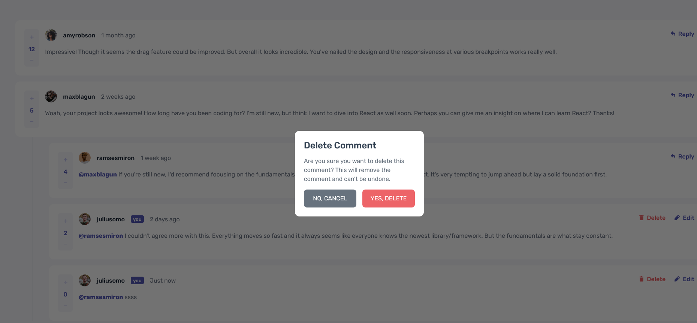

# Frontend Mentor - Interactive Comments Section 💬

[](https://react.dev/)
[](https://www.typescriptlang.org/)
[](https://vitejs.dev/)
[](https://tailwindcss.com/)
[](https://vitest.dev/)
[](https://testing-library.com/)
[](https://prettier.io/)



### 🌐 Live Demo:

**[View live site →](https://front-end-mentor-interactive-commen-psi.vercel.app/)**

Deployed on Vercel with HTTPS and performance optimizations.

---

This is a solution to the [Interactive comments section challenge on Frontend Mentor](https://www.frontendmentor.io/challenges/interactive-comments-section-iG1RugEG9). Frontend Mentor challenges help you improve your coding skills by building realistic projects.

## Table of contents

- [Overview](#overview)
  - [The challenge](#the-challenge)
  - [Screenshot](#screenshot)
  - [Links](#links)
- [My process](#my-process)
  - [Built with](#built-with)
  - [What I learned](#what-i-learned)
  - [Continued development](#continued-development)
- [Author](#author)
- [Acknowledgments](#acknowledgments)

## Overview

### The challenge

Users should be able to:

- View the optimal layout for the app depending on their device's screen size
- See hover states for all interactive elements on the page
- Create, Read, Update, and Delete comments and replies
- Upvote and downvote comments

### Screenshot

<table>
  <tr>
    <td></td>
    <td></td>
  </tr>
  <tr>
    <td></td>
    <td></td>
  </tr>
</table>

### Links

- Live Site URL: [Vercel Deployment](https://front-end-mentor-interactive-commen-psi.vercel.app/)
- GitHub Repository: [Front-end_Mentor_Interactive_Comments_Full-Stack](https://github.com/TomSif/Front-end_Mentor_Interactive_Comments_Full-Stack/tree/main/front)

## My process

### Built with

- Semantic HTML5 markup, including a native `<dialog>` element for the delete-confirmation modal
- Mobile-first workflow, driven by the provided mobile/desktop mockups
- [React 19](https://react.dev/) - JS library
- [TypeScript](https://www.typescriptlang.org/)
- [Vite](https://vitejs.dev/) - Build tool (`react-ts` template)
- [Tailwind CSS v4](https://tailwindcss.com/) - Utility-first CSS via the native `@tailwindcss/vite` plugin, with design tokens and text presets extracted from the Figma captures into `@theme` and `@utility`
- [Vitest](https://vitest.dev/) - Unit and component test runner (`jsdom` environment, `globals: true`)
- [React Testing Library](https://testing-library.com/) + `@testing-library/jest-dom` + `user-event` - Behaviour-first component testing (24 tests covering pure utility functions and component interactions)
- [Prettier](https://prettier.io/) + `prettier-plugin-tailwindcss` - Formatting and automatic class ordering

### What I learned

#### A recursive component for comments and replies

The biggest architectural decision was to use a **single `CommentCard` component** for both top-level comments and nested replies, calling itself recursively rather than duplicating markup for each level. I was skeptical this could work without spiraling out of control, but after seeing the pattern explained once, writing it myself made the logic click.

```tsx
// CommentCard.tsx — simplified shape of the recursion
function CommentCard({
  comment,
  currentUser,
  onVote,
  onReply,
  onEdit,
  onDelete,
}: CommentCardProps) {
  return (
    <li>
      {/* ...comment content, votes, actions... */}
      {comment.replies?.map((reply) => (
        <CommentCard
          key={reply.id}
          comment={reply}
          currentUser={currentUser}
          {...handlers}
        />
      ))}
    </li>
  )
}
```

The part that made it click, and that I noted myself at the end of that session: data that only concerns the recursion — like `replyingTo`, used to show the `@username` prefix on a reply — never needs to travel back up to `App`. It can stay entirely local to the component calling itself.

#### Immutable updates on two levels of nested state

`comments[].replies[]` is a nested structure, so every mutation (vote, edit, delete) has to update the right item **without mutating the array or its objects** — and, unlike a flat list, the target item can live at two different depths. This was flagged from the very start as the riskiest part of the project, and it turned out to be exactly that:

```ts
// utils/comments.ts — vote logic reaching into a nested reply
export function applyVote(
  comments: Comment[],
  id: number,
  direction: 'up' | 'down'
): Comment[] {
  return comments.map((comment) => {
    if (comment.id === id)
      return {
        ...comment,
        score: comment.score + (direction === 'up' ? 1 : -1),
      }
    return {
      ...comment,
      replies: comment.replies.map((reply) =>
        reply.id === id
          ? { ...reply, score: reply.score + (direction === 'up' ? 1 : -1) }
          : reply
      ),
    }
  })
}
```

Once the two-spread pattern was understood, I was able to write the edit and delete logic on my own by mirroring the same structure — a good sign the concept had actually landed rather than just being copy-pasted once.

#### `useRef` as a "don't run yet" flag, not a state trigger

`localStorage` persistence introduced a subtle bug: the save effect fired **before** the initial fetch had finished, silently overwriting saved data with an empty array. The fix was a `useRef<boolean>` flag to distinguish the first render from subsequent ones — without triggering an extra re-render the way a `useState` would have:

```ts
const isInitialized = useRef(false)

useEffect(() => {
  if (!isInitialized.current) {
    isInitialized.current = true
    return // skip the save on first render
  }
  localStorage.setItem('comments', JSON.stringify(comments))
}, [comments])
```

This was the moment the difference between `useState` (re-renders) and `useRef` (persists silently across renders) stopped being an abstract rule and became a tool I reach for deliberately.

#### Tests as a first-class deliverable, and the gotchas they surfaced

With 24 Vitest + RTL tests covering both pure utility functions and `CommentCard` interactions, testing was where several accessibility and sequencing assumptions got corrected:

- **`alt` text on decorative icons counts toward a button's accessible name.** An icon with `alt="icon delete"` next to a "Delete" label produced the accessible name "icon delete Delete" — not what `getByRole('button', { name: 'Delete' })` expected. Fixed with `alt=""` on purely decorative icons.
- **`aria-label` silently overrides visible text.** A `Reply` button had a redundant `aria-label` that hid the word "Reply" from accessible-name queries entirely.
- **Scenario order matters in multi-step interaction tests.** The edit-mode textarea doesn't exist in the DOM until _after_ the Edit button is clicked — querying for it beforehand simply fails, which anchored the render → trigger → query → act → assert sequence for good.

### Continued development

- **Deep prop chains** — tracing props through `App → CommentCard → recursive → CommentInput` is manageable piece by piece, but following the full chain in one pass is still effortful past two or three levels. Making this instinctive is the next target.
- **Closures vs. arguments in JSX callbacks** — a bug where a delete handler kept capturing the root comment's `id` instead of the nested reply's `id` was invisible until I understood _why_ a closure over `comment.id` behaves differently from passing the id as an argument. Worth deliberately checking for on every callback passed down through recursion.
- **Dynamic relative timestamps** — the bonus of replacing the static `createdAt` strings with a live "X minutes ago" display (via `Intl.RelativeTimeFormat` or a manual calculation) wasn't tackled in this pass and is a natural next addition.

## Author

- Frontend Mentor - [@TomSif](https://www.frontendmentor.io/profile/TomSif)
- GitHub - [@TomSif](https://github.com/TomSif)

## Acknowledgments

This project was built with AI-assisted mentoring (Claude). The approach: I code by hand, Claude acts as a Socratic mentor — asking questions, explaining concepts, reviewing my reasoning. The architectural decisions stayed mine to make.

Specific AI contributions are documented transparently in my [progression log](./progression.md):

- **Written by Claude:** direct, fully commented explanations on genuinely new ground — the recursive-component pattern, the two-level immutable update on nested state, the `useRef`-as-flag pattern for guarding an effect on first render, and the RTL/`userEvent` async testing cycle
- **My initiative:** recognizing that recursion-local data (`replyingTo`) never needs to be lifted to `App`; choosing `disabled` + Tailwind's `disabled:` variants for restricting votes on my own comments; extracting pure functions out of `App.tsx` handlers into `utils/comments.ts` after a single explanation of the pattern; reasoning through the `utils/` vs `services/` distinction on my own
- **Collaborative:** diagnosing the closure-vs-argument bug on the delete/reply handlers; working through the accessible-name conflicts between `alt` text and `aria-label` that surfaced through testing; and pinning down the render-order bug behind the `localStorage` "saved too early" issue
